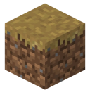
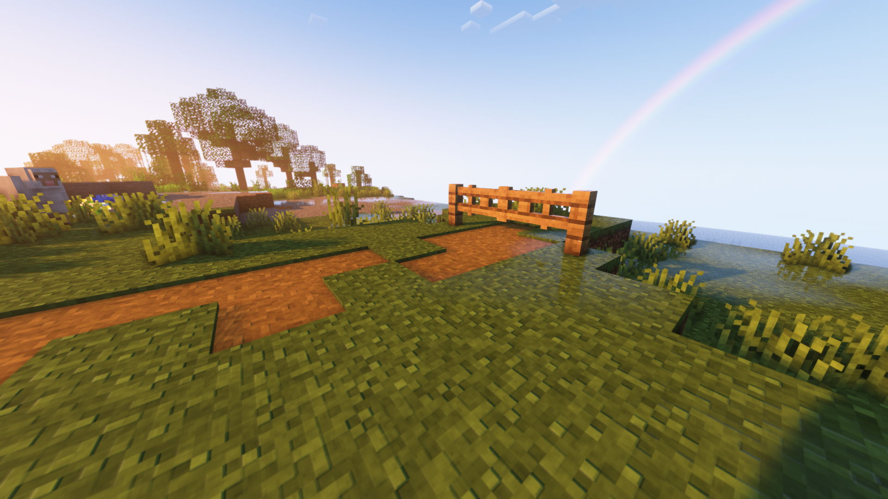
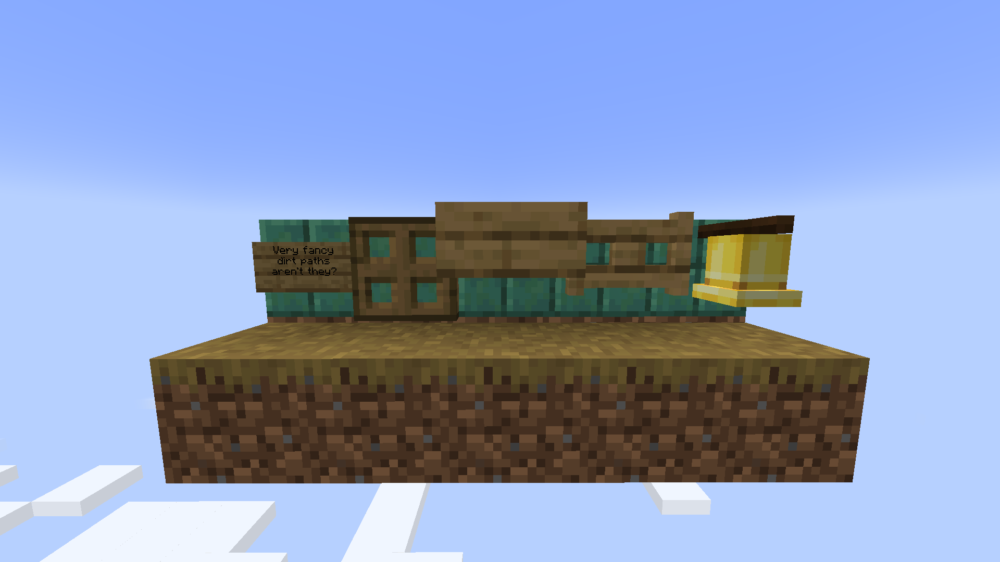

# Path under fence gates

Allows you to make dirt paths under fence gates, and more!  
This mod fixes [MC-84731](https://bugs.mojang.com/browse/MC-84731), which includes (besides fence gates) wall signs, trapdoors, slabs, and bells.

## Dependencies

- None (does not require Fabric/Quilt API)!

## Download

Supports Minecraft versions 1.19-1.19.3.  
Made for the Fabric and Quilt modloaders.  
Server and client side.

## FAQ

- Q: Will you be backporting this to lower Minecraft versions?  
A: No.

- Q: Forge pls?  
A: Also no.

- Q: Does only the server need this mod or does the client need it too?  
A: Both the client and the server need this mod.

## License

This project is licensed under LGPLv2.1, see [LICENSE](https://github.com/Steveplays28/pathunderfencegates/blob/main/LICENSE).
